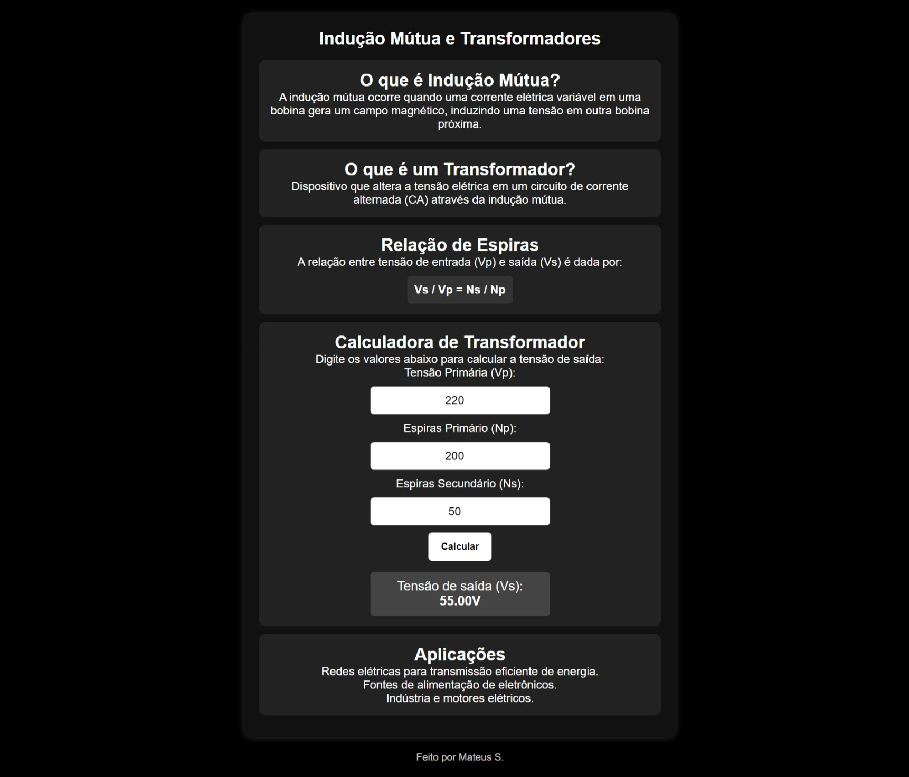

# Indução Mútua e Transformadores

Uma aplicação web interativa que explica os conceitos de indução mútua e transformadores, incluindo uma calculadora para determinar a tensão de saída com base na relação de espiras.

## Imagens

*Acima está uma captura de tela inicial da aplicação.*

## Funcionalidades
- Explicação sobre indução mútua e transformadores  
- Calculadora para determinar a tensão de saída  
- Aplicações práticas dos transformadores  

## Como Usar
1. Insira os valores da **tensão primária (Vp)** e o número de **espiras do primário (Np)** e **secundário (Ns)**.  
2. Clique no botão **"Calcular"**.  
3. O resultado da **tensão secundária (Vs)** será exibido.  

## Testando a Calculadora
Para testar a calculadora de transformadores, você pode usar os seguintes valores:

**Caso 1 - Transformador Redutor**  
- **Tensão Primária (Vp):** 220V  
- **Espiras Primário (Np):** 200  
- **Espiras Secundário (Ns):** 50  

Com esses valores, a calculadora deve retornar uma **tensão secundária (Vs) de 55V**. 

## Créditos

Desenvolvido por Mateus S.  
GitHub: [Matz-Turing](https://github.com/Matz-Turing)
